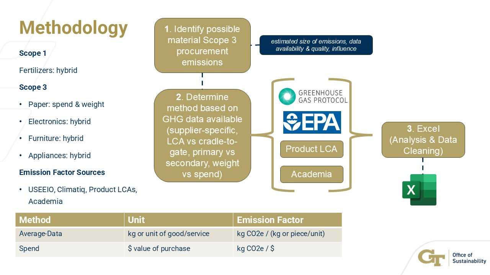

## Scope 3 Procurement GHG Emissions Analysis

[Scope 3 Procurement GHG Analysis Final Presentation](Final_Pres_Fellowship_Riley.pdf)
## Wundergrub's Alternative Protein Pilot Program Feasability Study

## Random Forest Regressor & Regression Neural Network Used Car Prediction Algo

## Predicting VC Success

